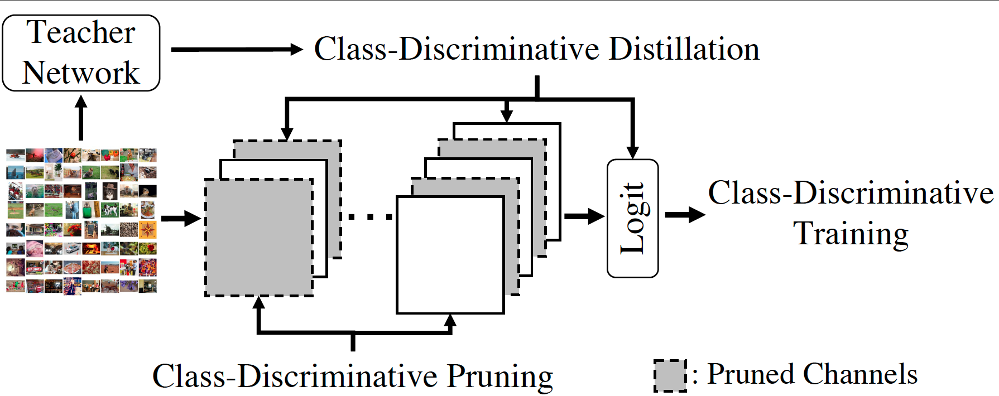

# Class-Discriminative CNN Compression [[Paper]](https://arxiv.org/abs/2110.10864)


## Paper in ICPR2022
```BibTex
@inproceedings{liu2022class,
  title     = {Class-Discriminative CNN Compression},
  author    = {Liu, Yuchen and Wentzlaff, David and Kung, S.Y.},
  booktitle = {2022 26th International Conference on Pattern Recognition (ICPR)},
  year      = {2022},
}
```

This repository contains the codes for *Class-Discriminative CNN Compression*, which is published in ICPR2022.

## Overview

<a></a>

We propose two class-discriminative based network compression techniques, class-discriminative pruning and class-discriminative distillation which fits seamlessly with the class-discriminative training goal. 

## Usage

### Working Environment

We have tested our codes with the following setups:

```
python==3.6.5
tensorflow==1.14.0
numpy==1.16.0
```


### Training Full-Size Original Model from Scratch

Training an original full-size model can be conducted by:

```
python3 model_training.py
```

This experiment is fully controlled by the hyper-parameters specified in the file `ResNet_hyperparams_training.py`. By default, it will train a ResNet-56 on CIFAR-100 from scratch. 


### Class-Discriminative Pruning

With the full-size model file (referred as `trained_ResNet_ckpt.pkl` here) saved from the above training from scratch experiment, we can perform class-discriminative pruning by:

```
python3 model_CDC_pruning.py \
	--model=trained_ResNet_ckpt.pkl
```

The hyper-parameter setting of this experiment is fully specified in the file of `ResNet_hyperparams_CDC_pruning.py`. 
By default, we use Generalized Symmetric Divergennce as the channel pruning function to obtain the channel's discriminative score. 
Moreover, we employ hierarchical pruning mechanism where the front layers are pruned by fine labels and the rear layers use coarse labels. 
This hierarchy is spcified by the file `./CIFAR_100_Coarse_Label/cifar100_coarse_ytr_confusion_matrix_spectral_clustering.npy`.


### Class-Discriminative Distillation

With the teacher file (referred as `trained_ResNet_ckpt.pkl`) saved from training scratch and pruned model file (referred as `pruned_ResNet_ckpt.pkl`) saved from the CDC pruning experiment, we can retrain the compressed model with class-discriminative distillation by:

```
python3 model_CDC_distillation.py \
	--teacher_model=trained_ResNet_ckpt.pkl \
	--model=pruned_ResNet_ckpt.pkl
```

The hyper-parameter setting of this experiment is fully specified in the file of `ResNet_hyperparams_CDC_distillation.py`. 
We use DCA-based intermediate distillation where the coarse label is used to learn the DCA subspace. 


### Output

The final output is a CDC-compressed ResNet-56 on CIFAR-100. 